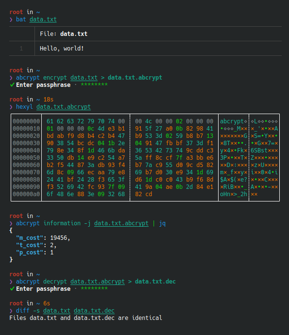

<!--
SPDX-FileCopyrightText: 2022 Shun Sakai

SPDX-License-Identifier: GPL-3.0-or-later
-->

# abcrypt

[![CI][ci-badge]][ci-url]
[![Version][version-badge]][version-url]
![License][license-badge]

**abcrypt** ([`abcrypt-cli`][version-url]) is a command-line utility for
encrypt and decrypt files using the [abcrypt format].



## Installation

### From source

```sh
cargo install abcrypt-cli
```

If you want to enable optimizations such as LTO, set them using [environment
variables].

### From binaries

The [release page] contains pre-built binaries for Linux, macOS and Windows.

### How to build

Please see [BUILD.adoc].

## Usage

### Basic usage

Encrypt a file:

```sh
abcrypt encrypt data.txt > data.txt.abcrypt
```

Decrypt a file:

```sh
abcrypt decrypt data.txt.abcrypt > data.txt
```

### Provides information about the encryption parameters

Output as a human-readable string:

```sh
abcrypt information data.txt.abcrypt
```

Output:

```text
Parameters used: m_cost = 32; t_cost = 3; p_cost = 4;
```

Output as JSON:

```sh
abcrypt information -j data.txt.abcrypt | jq
```

Output:

```json
{
  "m_cost": 32,
  "t_cost": 3,
  "p_cost": 4
}
```

### Generate shell completion

`--generate-completion` option generates shell completions to stdout.

The following shells are supported:

- `bash`
- `elvish`
- `fish`
- `nushell`
- `powershell`
- `zsh`

Example:

```sh
abcrypt --generate-completion bash > abcrypt.bash
```

## Command-line options

Please see the following:

- [`abcrypt(1)`]
- [`abcrypt-encrypt(1)`]
- [`abcrypt-decrypt(1)`]
- [`abcrypt-information(1)`]
- [`abcrypt-help(1)`]

## Changelog

Please see [CHANGELOG.adoc].

## Contributing

Please see [CONTRIBUTING.adoc].

## License

Copyright &copy; 2022&ndash;2023 Shun Sakai (see [AUTHORS.adoc])

1. This program is distributed under the terms of the _GNU General Public
   License v3.0 or later_.
2. Some files are distributed under the terms of the _Creative Commons
   Attribution 4.0 International Public License_.

This project is compliant with version 3.0 of the [_REUSE Specification_]. See
copyright notices of individual files for more details on copyright and
licensing information.

[ci-badge]: https://img.shields.io/github/actions/workflow/status/sorairolake/abcrypt/CI.yaml?branch=develop&label=CI&logo=github&style=for-the-badge
[ci-url]: https://github.com/sorairolake/abcrypt/actions?query=branch%3Adevelop+workflow%3ACI++
[version-badge]: https://img.shields.io/crates/v/abcrypt-cli?style=for-the-badge
[version-url]: https://crates.io/crates/abcrypt-cli
[license-badge]: https://img.shields.io/crates/l/abcrypt-cli?style=for-the-badge
[abcrypt format]: ../../docs/FORMAT.adoc
[environment variables]: https://doc.rust-lang.org/cargo/reference/environment-variables.html#configuration-environment-variables
[release page]: https://github.com/sorairolake/abcrypt/releases
[BUILD.adoc]: BUILD.adoc
[`abcrypt(1)`]: https://sorairolake.github.io/abcrypt/book/cli/man/man1/abcrypt.1.html
[`abcrypt-encrypt(1)`]: https://sorairolake.github.io/abcrypt/book/cli/man/man1/abcrypt-encrypt.1.html
[`abcrypt-decrypt(1)`]: https://sorairolake.github.io/abcrypt/book/cli/man/man1/abcrypt-decrypt.1.html
[`abcrypt-information(1)`]: https://sorairolake.github.io/abcrypt/book/cli/man/man1/abcrypt-information.1.html
[`abcrypt-help(1)`]: https://sorairolake.github.io/abcrypt/book/cli/man/man1/abcrypt-help.1.html
[CHANGELOG.adoc]: CHANGELOG.adoc
[CONTRIBUTING.adoc]: ../../CONTRIBUTING.adoc
[AUTHORS.adoc]: ../../AUTHORS.adoc
[_REUSE Specification_]: https://reuse.software/spec/
